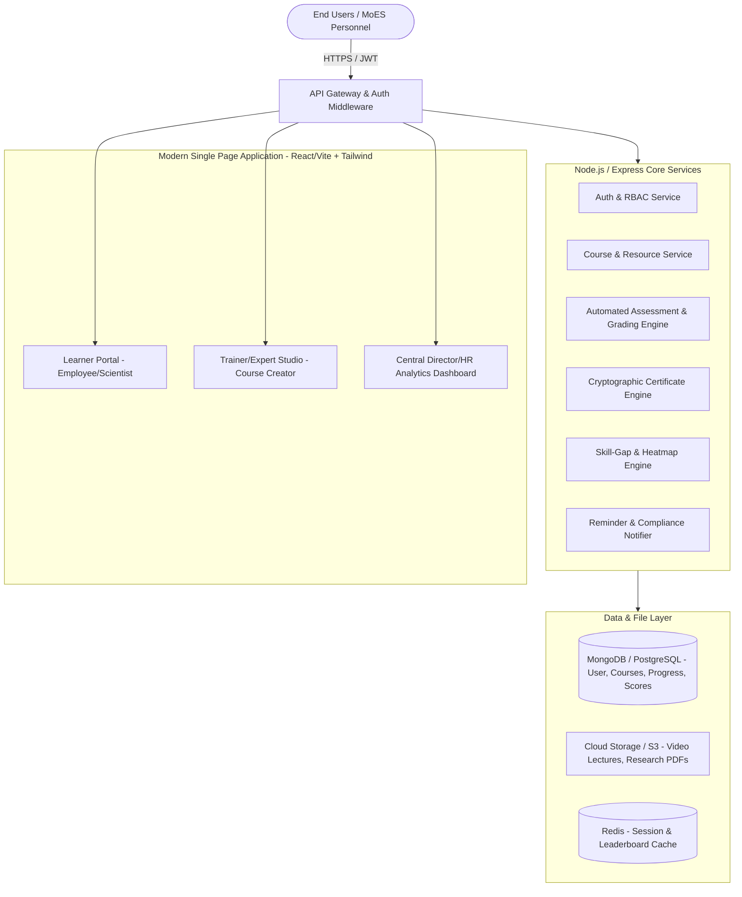

# 🌍 CAPACITY CONNECT — CENTRALIZED CAPACITY BUILDING & LMS PLATFORM
### 🏆 Smart India Hackathon 2026 | Problem Statement ID: SIH26075
**Theme:** Smart Education / Governance  
**Category:** Software (Student Innovation / Ministry Track)  
**Sponsoring Ministry:** Ministry of Earth Sciences (MoES), Government of India  
**Target Institutes:** IMD, INCOIS, IITM, NCMRWF, NIOT, NCPOR, CMLRE  

---

## 📌 Executive Summary
**Capacity Connect** is a next-generation, centralized, role-based Learning Management & Competency Development System (LMS/TMS) designed specifically for the **Ministry of Earth Sciences (MoES)** and its subordinate autonomous institutes. It replaces fragmented, ad-hoc, email/spreadsheet-driven training workflows with a unified, data-driven ecosystem.

The platform provides end-to-end management of training lifecycles: from curriculum creation and interactive multi-format learning to automated proctored assessments, cryptographically verifiable digital certifications, and real-time leadership analytics with institutional **Skill-Gap Heatmaps**.

---

## 🎯 1. Problem Statement Analysis & Ground Reality

### 1.1 Current Ground Reality at MoES Institutes
The Ministry of Earth Sciences oversees critical scientific bodies:
- **IMD (India Meteorological Department):** Weather forecasting, cyclone tracking, agro-meteorology.
- **INCOIS (Indian National Centre for Ocean Information Services):** Tsunami warning, ocean state forecast, potential fishing zones.
- **IITM (Indian Institute of Tropical Meteorology):** Climate modeling, monsoon dynamics.
- **NCMRWF (National Centre for Medium Range Weather Forecasting):** High-Performance Computing (HPC) & numerical weather prediction.
- **NIOT (National Institute of Ocean Technology):** Deep sea technology, desalination, ocean acoustics.
- **NCPOR (National Centre for Polar and Ocean Research):** Antarctic & Arctic expeditions, cryospheric science.

### 1.2 Pain Points & Gaps
1. **Information Silos:** Training materials (PDFs, PPTs, recorded webinars, HPC manual runs) are scattered across local departmental intranet drives, individual emails, and Google Drives.
2. **Lack of Centralized Tracking:** Administrative heads have zero real-time visibility into who is upskilled in advanced HPC routines, Doppler radar calibration, or tsunami alert protocols.
3. **Absence of Standardized Evaluation:** Offline pen-and-paper or informal quizzes with no uniform competence benchmarks.
4. **Certificate Forgery & Verification Hassle:** Hard-copy paper certificates or plain unauthenticated PDFs that cannot be independently validated.
5. **No Predictive Skill Gap Analysis:** MoES HR and directorates lack analytics to understand which institute/cadre is lacking vital competencies (e.g., Python for Ocean Data, HPC Slurm scripting, Disaster SOPs).

---

## 💡 2. The Solution: "Capacity Connect" Architecture



---

## 👥 3. User Roles & Permission Matrix (RBAC)

| Role | Key Capabilities & Accessible Modules |
| :--- | :--- |
| **1. Super Admin / MoES HQ Director** | Platform-wide analytics, institute-level comparisons (IMD vs INCOIS vs NIOT), training budget allocation, compliance monitoring, ministry-wide notification broadcast, audit logs. |
| **2. Institute Admin / HR Officer** | Institute-specific employee onboarding, mandatory course assignment, local compliance reports, approving trainer nominations. |
| **3. Trainer / Subject Matter Expert (SME)** | Course builder (video, audio, PDF, Jupyter notebook links), question bank creation (MCQ, scenario-based), grading subjective tasks, hosting live Q&A sessions. |
| **4. Learner / MoES Employee (Scientist, Technical Staff, Admin)** | Self-enrollment, interactive course consumption, progress saving, taking quizzes, generating verifiable PDF certificates, badge collection, peer leaderboard. |
| **5. Public / External Verifier** | Instant QR-code / Certificate ID verification page with zero login barrier. |

---

## 📦 4. Detailed Functional Modules

### 4.1 Module 1: Role-Based Authentication & User Management
- Secure JWT-based authentication with refresh tokens and bcrypt password hashing.
- Institute & Cadre profiling:
  - Department dropdown: IMD, INCOIS, IITM, NCMRWF, NIOT, NCPOR, HQ.
  - Cadre: Scientist B to G, Technical Officer, Administrative Staff, Research Fellow.
- Role-based redirection upon login (Learner -> Dashboard, Trainer -> Studio, Admin -> Intelligence Console).

### 4.2 Module 2: Course Studio & Multi-Format Content Hub
- **Modular Hierarchy:** Course ➔ Modules/Weeks ➔ Lessons (Video, PDF, Reading, Code Snippet, Interactive Checklist).
- **Domain-Specific Course Catalog:**
  - *Module Example 1:* Numerical Weather Prediction & HPC Workflow (NCMRWF)
  - *Module Example 2:* Doppler Weather Radar Calibration & Maintenance (IMD)
  - *Module Example 3:* Ocean Data Analysis with Python & Argo Floats (INCOIS)
  - *Module Example 4:* Antarctic Survival Protocols & Field Safety (NCPOR)
  - *Module Example 5:* Government e-Marketplace (GeM) Procurement Rules for Technical Officers
- **Mandatory vs. Elective Flags:** Allows HR to enforce mandatory compliance courses with deadlines.
- **Prerequisites & Learning Paths:** Lock Module B until Module A is completed.

### 4.3 Module 3: Learner Progress & Interactive Experience
- Resume-from-where-you-left tracking (video playback timestamp and scroll tracking).
- Dynamic progress bar (% completed) calculated in real-time.
- Interactive notes-taking widget synced to timestamps.
- Discussion forum / Q&A thread per lesson.

### 4.4 Module 4: Assessment & Evaluation Engine
- Auto-graded quizzes: Multiple Choice Questions (Single / Multi-select), True/False, Fill in the blanks.
- Randomized question orders & shuffled options to prevent malpractices.
- Configurable rules:
  - Passing percentage (e.g., 75% required for certification).
  - Time limit (countdown timer with auto-submit).
  - Maximum retry attempts with cool-off periods.
- Instant score breakdown with diagnostic feedback (identifies weak topics).

### 4.5 Module 5: Cryptographic Verifiable Digital Certificate Engine
- Automated generation of professional government-standard certificates upon course completion + passing score.
- **Tamper-Proof Verification Elements:**
  - Unique alphanumeric Certificate UUID (e.g., `MOES-CC-2026-IMD-89412`).
  - Embedded dynamic QR code pointing directly to `https://capacityconnect.gov.in/verify/:certId`.
  - SHA-256 digital signature hash embedded in the metadata.
  - Direct 1-click PDF download using client-side `jspdf` / `html2canvas` or server-side `pdf-lib`.

### 4.6 Module 6: Executive Analytics & Skill-Gap Heatmap (Admin USP)
- **Ministry Overview KPIs:** Total Active Trainees, Course Completion Ratio, Average Assessment Score, Total Learning Hours Logged.
- **Institutional Benchmarking:** Comparative bar charts comparing completion speeds between institutes (e.g., IMD vs IITM).
- **Interactive Skill-Gap Matrix:**
  - Visual color-coded matrix (Red = High Gap, Yellow = Moderate, Green = Proficient) mapping institutes to essential competency clusters (e.g., AI/ML Weather Forecasting, Ocean Instrumentation, Cyber Security, General Admin).
- **Exportable Compliance Reports:** 1-click export to CSV/Excel/PDF for parliamentary or ministerial committee reviews.

### 4.7 Module 7: Gamification & Engagement Layer
- **Karma / Knowledge Points (KP):** Earn points on completing lessons, submitting timely assignments, and maintaining daily learning streaks.
- **Milestone Badges:**
  - 🥉 *Bronze Explorer:* Completed first course.
  - 🥈 *Radar Specialist:* Passed radar assessment with 90%+.
  - 🥇 *MoES Scholar:* Completed 5 advanced modules.
- **Institute & Department Leaderboard:** Fosters healthy inter-departmental motivation.

### 4.8 Module 8: Multi-Lingual & Accessibility (Smart Education Theme)
- Bilingual interface toggle: **English** & **हिन्दी (Hindi)** catering to Central Government official language (Rajbhasha) mandates.
- High-contrast toggle and WCAG 2.1 compliance features.

---

## 🗄️ 5. Database Schema (MongoDB / Mongoose Representation)

### 5.1 `Users` Collection
```json
{
  "_id": "ObjectId",
  "name": "Dr. Rajesh Sharma",
  "email": "rajesh.sharma@imd.gov.in",
  "passwordHash": "$2b$10$...",
  "role": "learner", // "admin" | "trainer" | "learner"
  "institute": "IMD", // "IMD" | "INCOIS" | "IITM" | "NCMRWF" | "NIOT" | "NCPOR"
  "designation": "Scientist D",
  "department": "Monsoon Forecasting Division",
  "avatar": "https://...",
  "points": 450,
  "badges": ["FIRST_STEP", "RADAR_EXPERT"],
  "createdAt": "2026-09-01T10:00:00Z"
}
```

### 5.2 `Courses` Collection
```json
{
  "_id": "ObjectId",
  "title": "Advanced Doppler Weather Radar Interpretation",
  "code": "MOES-IMD-401",
  "description": "Comprehensive operational training on DWR calibration, data assimilation, and severe storm tracking.",
  "category": "Atmospheric Sciences",
  "targetInstitutes": ["IMD", "IITM"],
  "instructor": {
    "name": "Dr. Anita Desai",
    "title": "Chief Radar Specialist, MoES"
  },
  "thumbnail": "https://...",
  "durationMinutes": 320,
  "level": "Intermediate",
  "isMandatory": true,
  "deadline": "2026-10-15T00:00:00Z",
  "modules": [
    {
      "moduleId": "m1",
      "title": "DWR Principles and Dual-Polarization",
      "lessons": [
        {
          "lessonId": "l101",
          "title": "Basics of Radar Echo Analysis",
          "type": "video",
          "videoUrl": "https://...",
          "duration": 45
        },
        {
          "lessonId": "l102",
          "title": "Operational Safety & Radar Calibration SOP",
          "type": "pdf",
          "fileUrl": "https://..."
        }
      ]
    }
  ],
  "quiz": {
    "passingScore": 80,
    "timeLimitMinutes": 20,
    "questions": [
      {
        "questionId": "q1",
        "question": "Which radar parameter is primary indicator of hail detection?",
        "options": ["Reflectivity (Z)", "Differential Reflectivity (ZDR)", "Correlation Coefficient", "Radial Velocity"],
        "correctIndex": 1,
        "explanation": "ZDR provides differential size information indicative of non-spherical hail stones."
      }
    ]
  }
}
```

### 5.3 `Enrollments` Collection
```json
{
  "_id": "ObjectId",
  "userId": "ObjectId(User)",
  "courseId": "ObjectId(Course)",
  "progressPercentage": 100,
  "completedLessons": ["l101", "l102"],
  "quizAttempt": {
    "attempted": true,
    "score": 90,
    "passed": true,
    "attemptedAt": "2026-09-08T14:30:00Z"
  },
  "status": "completed", // "enrolled" | "in-progress" | "completed"
  "certificateId": "MOES-CC-2026-IMD-89412",
  "enrolledAt": "2026-09-02T11:00:00Z",
  "completedAt": "2026-09-08T14:35:00Z"
}
```

### 5.4 `Certificates` Collection
```json
{
  "certificateId": "MOES-CC-2026-IMD-89412",
  "userId": "ObjectId(User)",
  "userName": "Dr. Rajesh Sharma",
  "courseTitle": "Advanced Doppler Weather Radar Interpretation",
  "institute": "IMD",
  "issuedDate": "2026-09-08T14:35:00Z",
  "score": 90,
  "verificationUrl": "https://capacityconnect.gov.in/verify/MOES-CC-2026-IMD-89412",
  "digitalSignatureHash": "e3b0c44298fc1c149afbf4c8996fb92427ae41e4649b934ca495991b7852b855"
}
```

---

## 🌐 6. Key REST API Specifications

| Method | Endpoint | Description | Auth Required |
| :--- | :--- | :--- | :--- |
| `POST` | `/api/auth/register` | Register new employee/scientist | Public |
| `POST` | `/api/auth/login` | Login & return JWT + user profile | Public |
| `GET` | `/api/auth/me` | Current authenticated user details | Bearer JWT |
| `GET` | `/api/courses` | List all available courses (filter by institute/category) | Public / User |
| `GET` | `/api/courses/:id` | Full details of a course with syllabus | User |
| `POST` | `/api/courses` | Create new course with modules & quiz | Trainer / Admin |
| `POST` | `/api/courses/:id/enroll` | Enroll current user in a course | Learner |
| `POST` | `/api/courses/:id/progress` | Update completed lesson & progress % | Learner |
| `POST` | `/api/courses/:id/quiz/submit` | Evaluate quiz, calculate grade, award cert | Learner |
| `GET` | `/api/certificates/:certId` | Public verification of certificate | Public |
| `GET` | `/api/admin/analytics/overview` | Overall ministry statistics | Admin |
| `GET` | `/api/admin/analytics/skill-matrix`| Institute vs Skill competence heatmap data | Admin |
| `GET` | `/api/leaderboard` | Top learners by knowledge points | User |

---

## 🎨 7. UI/UX Design System & Screen Specifications

### 7.1 Aesthetics & Branding
- **Color Palette:**
  - Primary Deep Navy: `#0B192C` (Authority, Ministry branding)
  - Indian Ocean Cyan: `#008DDA` / `#41C9E2` (Earth & Ocean sciences connection)
  - Crisp White / Slate Light: `#F8FAFC` & `#FFFFFF` (Clarity and readability)
  - Accent Gold: `#F59E0B` (Certificates, Badges, Honors)
  - Success Emerald: `#10B981` (Passing grades, Completion status)
- **Visual Identity:** Ashok Stambh & MoES-inspired clean header, subtle glassmorphism cards, modern Inter/Outfit font.

### 7.2 Core Screens to Build in Prototype
1. **Landing & Portal Gateway:**
   - Hero section with live stats counter (e.g., 6 Autonomous Bodies, 24,000+ Training Hours, 150+ Technical Courses).
   - Ministry Institutes Ribbon (IMD, INCOIS, IITM, NCMRWF, NIOT, NCPOR).
   - Quick Certificate Verifier search bar.
2. **Learner Dashboard (`/dashboard`):**
   - Active Enrollments with linear progress bars.
   - Upcoming Mandatory Compliance Deadlines alert banner.
   - Skill Badges & Knowledge Points showcase.
   - Recommended Courses based on user's institute.
3. **Interactive Course Player (`/courses/:id`):**
   - Left sidebar with collapsible module accordions & completion checkmarks.
   - Main content viewer (embedded video player with playback speed controls, PDF slide viewer).
   - Bottom tab bar: Overview, Resources, Notes, and Q&A.
4. **Quiz & Examination Portal (`/courses/:id/quiz`):**
   - Clean distraction-free assessment layout with floating countdown timer.
   - Question palette (Answered, Unanswered, Marked for Review).
   - Instant Result Modal with score badge, review breakdown, and "Claim Certificate" CTA.
5. **Dynamic Digital Certificate Viewer (`/verify/:certId`):**
   - High-fidelity ornamental border, Government emblem, student name, institute badge, QR code, and signatures of Director General.
   - Action buttons: "Download PDF", "Share on LinkedIn", "Print".
6. **Executive Analytics & Skill Heatmap (`/admin`):**
   - Real-time stat counters (Enrollment velocity, Completion rates).
   - Interactive Bar & Radar Charts for Departmental Competencies.
   - The flagship **Skill-Gap Heatmap Matrix**.
   - Student roster table with instant CSV export.

---

## 🚀 8. Smart India Hackathon (SIH) Winning Strategy

### 8.1 Why this Project Will Impress the Jury
1. **Exact Alignment with MoES Mandate:** We are not making a generic "school LMS". The terminology, institutes (IMD, INCOIS, etc.), and courses are custom-tailored to Earth Sciences.
2. **Solves the "Ministry Skill-Gap" Problem:** Judges love data-driven governance. The Skill-Gap Heatmap gives directors actionable insight to plug national disaster-readiness vulnerabilities.
3. **Tamper-Proof Credentialing:** The verifiable certificate engine with direct QR validation solves real-world administrative verification burdens.
4. **Offline-Ready & Low-Bandwidth Mindset:** Designed for scientists stationed in remote radar stations, ocean research vessels (ORVs), and Antarctic stations (Maitri/Bharati) with lightweight assets.

---

*Document compiled for SIH 2026 Participation — Team Capacity Connect.*
