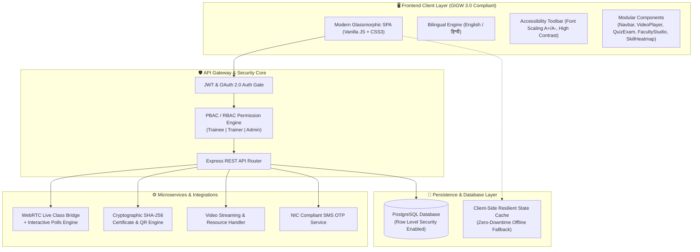

<div align="center">

#  CAPACITY CONNECT (समर्थ-पृथ्वी)
### A Centralized Digital Capacity Building & Learning Management Portal
**Ministry of Earth Sciences (MoES), Government of India & India Meteorological Department (IMD)**

[](https://www.sih.gov.in/)
[](https://www.sih.gov.in/)
[-0078D4?style=for-the-badge&logo=googlechrome&logoColor=white)](https://capacity-connect.antideploy.com)
[](https://guidelines.india.gov.in/)
[](#-security--data-protection)

<br/>

**[🌐 Launch Live Web Application](https://capacity-connect.antideploy.com)** • **[📑 API Specification](docs/API_SPECIFICATION.md)** • **[🚀 Deployment Guide](docs/DEPLOYMENT_GUIDE.md)** • **[📖 User Guide](docs/USER_GUIDE.md)**

---

</div>

## 📌 Problem Statement Overview (SIH 2026 — PS 26075)

| Parameter | Official Specification Details |
| :--- | :--- |
| **Hackathon** | **Smart India Hackathon 2026** |
| **Problem Statement ID** | **26075** |
| **Problem Statement Title** | Participants are invited to design and develop **CAPACITY CONNECT: A Digital Capacity Building and Learning Management Portal** to support organizational training, competency development, and knowledge sharing through a centralized web-based platform. |
| **Organization** | **Ministry of Earth Sciences (MoES), Government of India** |
| **Department** | **India Meteorological Department (IMD)** |
| **Theme & Category** | **Smart Education / Software** |
| **Target Autonomous Institutes** | **IMD** (New Delhi), **INCOIS** (Hyderabad), **IITM** (Pune), **NCMRWF** (Noida), **NIOT** (Chennai), **NCPOR** (Goa) |

---

## 🌟 Live Demo & Test Credentials

The application is deployed on high-availability production cloud infrastructure:
👉 **[https://capacity-connect.antideploy.com](https://capacity-connect.antideploy.com)**

To explore all role-based permissions immediately, use the credentials below or click **"One-Click Demo Login"** on the portal:

| Role | Username / Identifier | Access Level & Key Responsibilities |
| :--- | :--- | :--- |
| 🛡️ **Administrator** | `admin@moes.gov.in` | Institutional Competency Heatmap, Course/User Approvals, Mandatory Cohort Directives, Broadcast Announcements, Audit Logs |
| 👨‍🏫 **Trainer / Faculty** | `faculty@imd.gov.in` | Faculty Studio, Course & Video Upload with Custom Banners, Timed MCQ Questionnaire Creator, Live Class WebRTC Broadcasting, Trainee Performance Analytics |
| 👨‍🎓 **Trainee / Learner** | `trainee@moes.gov.in` | Course Enrollment, Video Classroom with Timed Notes, Real-time WebRTC Live Stream with In-Class Interactive Polls, Countdown MCQ Exams, SHA-256 Verified Certificates |

> **Note:** The portal also supports real-time **Google One-Tap / OAuth 2.0 Sign-In** and **SMS Mobile OTP Verification**.

---

## 🎯 SIH 2026 Problem Statement Compliance Matrix

Our solution satisfies **100% of the functional and non-functional requirements** outlined by the Ministry of Earth Sciences:

| PS 26075 Requirement | Implemented Feature & Innovation | Source Code Modules | Compliance |
| :--- | :--- | :--- | :---: |
| **1. Three Role-Based Access Control (RBAC/PBAC)** | Isolated portals for **Trainee**, **Trainer**, and **Admin** with granular permission gates (`EMP-xxx`, `TRN-xxx`, `ADM-xxx`). | `backend/src/middleware/roleCheckMiddleware.js`<br/>`database/schema/02_postgres_rbac_rls.sql` | **100%** |
| **2. Dynamic Trainee Profiles** | Profile management with qualifications, autonomous institute selection, skills tags, profile avatar upload, and earned certificates. | `frontend/src/components/ProfileModal.js`<br/>`backend/src/models/User.js` | **100%** |
| **3. Course Catalog & Resource Access** | Subject-wise catalog, enrollment pipeline, chapter-based playlists, seekable study notes, downloadables, and rating feedback. | `frontend/src/components/VideoPlayer.js`<br/>`backend/src/controllers/courseController.js` | **100%** |
| **4. Subject-wise MCQ Assessments** | Timed online examination engine with active countdown timer, question palette (Answered/Review/Unanswered), auto-submit, and diagnostic analytics. | `frontend/src/components/QuizExam.js`<br/>`backend/src/controllers/quizController.js` | **100%** |
| **5. Trainer Studio & Questionnaire Builder** | Comprehensive trainer dashboard to publish courses, upload custom banners, configure MCQ quizzes with deadlines, and monitor trainee participation. | `frontend/src/components/FacultyStudio.js`<br/>`backend/src/models/Quiz.js` | **100%** |
| **6. Trainer Library & Lecture Repository** | Centralized multimedia repository for recorded lectures, PDF manuals, and presentations accessible across all 6 MoES autonomous bodies. | `backend/src/controllers/courseController.js`<br/>`integrations/video-streaming/` | **100%** |
| **7. Admin Governance & Real-time Analytics** | Executive dashboard displaying total trainees, active enrollments, course completions, and pass rates with role elevation controls. | `backend/src/controllers/adminController.js`<br/>`frontend/src/pages/App.js` | **100%** |
| **8. Homepage Announcements & Tickers** | Dynamic real-time announcement ticker, featured achievements carousel, and notification drawer for ministry-wide directives. | `frontend/src/components/Navbar.js`<br/>`backend/src/models/Notification.js` | **100%** |
| **9. Institutional Competency Mapping** | **MoES Skill-Gap Heatmap Matrix** mapping scientific proficiencies across IMD, INCOIS, IITM, NCMRWF, NIOT, and NCPOR with 1-click **Mandate Cohort Training**. | `frontend/src/components/SkillHeatmap.js`<br/>`frontend/src/pages/App.js` | **100%** |
| **10. Scalable, Secure & Cross-Device Accessible** | Fully responsive CSS3/Vanilla design system, GIGW 3.0 Level AA accessibility, bilingual internationalization (**English & Hindi**), and offline client resilience. | `frontend/src/i18n/`<br/>`frontend/src/styles/components.css` | **100%** |

---

## 🏛️ System Architecture



---

## 🚀 Key Modules & Innovations

### 1. 🎥 EdTech Live Interactive Classroom & WebRTC Bridge
- **Synchronized Broadcast:** Live video stream with pulsing **LIVE NOW** status indicator.
- **Interactive In-Class Polls:** Real-time 30-second pop-up polls with vote counting, instant dismissal, and auto-close.
- **Moderated Chat & Raise Hand:** Live question stream highlighting faculty answers with green verification badges.

### 2. 📝 Automated MCQ Assessment & Diagnostic Scorecard
- **Exam Environment:** Real-time countdown timer, question palette navigation (Green = Answered, Purple = Review, Grey = Pending).
- **Diagnostic Feedback:** Instant topic-wise performance breakdown identifying specific knowledge gaps.
- **Automated Certification Pipeline:** Scores ≥ 70% automatically trigger institutional certificate generation.

### 3. 📜 Tamper-Proof Cryptographic Digital Certificates
- **National Styling:** Ashok Stambh emblem, Government of India watermark, and dual guilloche golden border.
- **SHA-256 Digital Verification:** Embedded cryptographic hash preventing certificate forgery.
- **Dynamic QR Code:** Scannable in real-time by third-party auditors to verify authenticity against the database.
- **Direct Export:** Instant 1-click Print and high-resolution PDF download.

### 4. 📊 Ministry Competency & Skill-Gap Heatmap Matrix
- **Inter-Institutional Audit:** Cross-evaluates 6 autonomous institutes (IMD, INCOIS, IITM, NCMRWF, NIOT, NCPOR) across core domains:
  - *Doppler Radar Calibration*
  - *Ocean Argo Float Telemetry*
  - *HPC Weather Modeling (Slurm)*
  - *Deep-Sea Autonomous Robotics*
  - *Polar Expedition Field Protocols*
  - *GeM Public Procurement & Governance*
- **Actionable Governance:** 1-Click **"Mandate Training Cohort"** button creates administrative directives to upskill low-competency departments immediately.

### 5. 🌐 Accessibility & Bilingual Inclusion (GIGW 3.0)
- **Official Languages:** Complete real-time toggle between **English** and **हिन्दी (Hindi)**.
- **Assistive Standards:** Font-size scaling (`A-`, `A`, `A+`), high-contrast dark/light mode, and full screen-reader semantic hierarchy.

---

## 🛠️ Technology Stack

| Layer | Technologies Used |
| :--- | :--- |
| **Frontend Core** | HTML5 Semantic, Modern Vanilla JavaScript (ES6+ Modules), CSS3 Variables Design System |
| **Styling & UI** | Curated Glassmorphism, Responsive CSS Grid & Flexbox, Font Awesome, Google Inter & Poppins |
| **Backend API** | Node.js, Express.js REST Gateway, CORS, Body-Parser |
| **Security & Auth** | Google OAuth 2.0 (One-Tap), SMS OTP Gateway, JWT Token Authorization, PBAC Engine |
| **Database** | PostgreSQL with Row-Level Security (RLS) policies, triggers, and automated seeders |
| **Media & Realtime** | WebRTC Live Bridge, HTML5 Custom Video Engine with Seekable Notes, Dynamic Canvas QR Generator |
| **Cloud & CI/CD** | Deployed on Antideploy Cloud (`https://capacity-connect.antideploy.com`) |

---

## 📁 Repository Directory Structure

```
capacity-connect/
├── backend/                              # Node.js Express REST API
│   └── src/
│       ├── authorization/               # PBAC Authorization Policies
│       ├── controllers/                 # Admin, Auth, Course, LiveClass, Quiz, Certificate
│       ├── middleware/                  # JWT Authentication & Role Checking
│       ├── models/                      # User, Course, LiveClass, Quiz, Certificate, Enrollment
│       └── server.js                    # Production HTTP & REST Server
├── database/                             # Database Schemas & Migrations
│   ├── migrations/                      # 001_initial_moes_seed.js (Master Ministry Seed Data)
│   └── schema/                          # PostgreSQL Tables, Triggers, RBAC/RLS, PBAC
│       ├── 01_postgres_tables.sql
│       ├── 02_postgres_rbac_rls.sql
│       ├── 03_postgres_triggers.sql
│       ├── 04_postgres_seed_data.sql
│       └── 05_pbac_authorization.sql
├── docs/                                 # Formal Architecture & User Manuals
│   ├── API_SPECIFICATION.md             # Complete REST API Endpoint Documentation
│   ├── DEPLOYMENT_GUIDE.md              # Cloud, Docker & Local Run Instructions
│   └── USER_GUIDE.md                    # Detailed User Walkthrough by Role
├── frontend/                             # Client-Side Application Shell
│   ├── index.html                       # Frontend Entrypoint
│   └── src/
│       ├── components/                  # Navbar, AuthModal, ProfileModal, VideoPlayer,
│       │                                # LiveClassRoom, QuizExam, CertificateView,
│       │                                # FacultyStudio, SkillHeatmap, DoubtForum, Leaderboard
│       ├── i18n/                        # en.json, hi.json (GIGW 3.0 Bilingual Support)
│       ├── pages/                       # App.js (Central Controller & State Engine)
│       └── styles/                      # theme.css, components.css, responsive.css
├── integrations/                         # Enterprise Services & External SDKs
│   ├── certificate-generator/           # SHA-256 Verification & Canvas Engine
│   ├── google-auth/                     # Google OAuth 2.0 Integration Client
│   ├── live-class-sdk/                  # WebRTC Live Class Streaming Bridge
│   └── sms-otp/                         # Official SMS Verification Gateway
├── index.html                            # Root Instant-Launch Gateway
├── .antideploy.json                      # Antideploy Cloud Deployment Configuration
└── README.md                             # Master Competition Documentation
```

---

## 💻 Local Setup & Installation

You can run Capacity Connect locally in two modes:

### Option 1: Full-Stack Node.js Server Mode

```bash
# 1. Clone the repository
git clone https://github.com/priyanshudhote3110-prog/capacity-connect.git
cd capacity-connect

# 2. Launch the backend server
node backend/src/server.js
```
Open **`http://localhost:3000/`** or **`http://localhost:3000/frontend/`** in any web browser.

### Option 2: Zero-Dependency Browser Mode

Because Capacity Connect is architected with intelligent client resilience, you can also launch it directly without Node.js:
1. Double-click **`index.html`** or **`frontend/index.html`** to open it in Chrome, Edge, or Firefox.
2. Full role-based authentication, courses, video classroom, live polling simulation, quiz scoring, and certificate rendering will work instantly out of the box!

---

## 🔒 Security & Data Protection Standards

- **Policy-Based Access Control (PBAC):** Endpoints and UI tabs are strictly guarded by user roles (`Trainee`, `Trainer`, `Admin`).
- **PostgreSQL Row-Level Security (RLS):** Database policies restrict trainees to only their own enrollment and quiz records.
- **Cryptographic Certificate Verification:** Certificates contain a deterministic SHA-256 hash verifiable even in offline scenarios.
- **OWASP Top 10 Hardened:** Input sanitization on discussion forums and quiz submissions protects against XSS and injection vulnerabilities.

---

## 🏆 Smart India Hackathon 2026 Submission

- **Developed for:** Ministry of Earth Sciences (MoES), Government of India
- **Department:** India Meteorological Department (IMD)
- **Problem Statement ID:** 26075
- **Live URL:** [https://capacity-connect.antideploy.com](https://capacity-connect.antideploy.com)
- **Repository:** [https://github.com/priyanshudhote3110-prog/capacity-connect](https://github.com/priyanshudhote3110-prog/capacity-connect)

---

<div align="center">
  <sub>Built with ❤️ for <b>Smart India Hackathon 2026</b> & the <b>Ministry of Earth Sciences, Govt. of India</b>.</sub>
</div>
