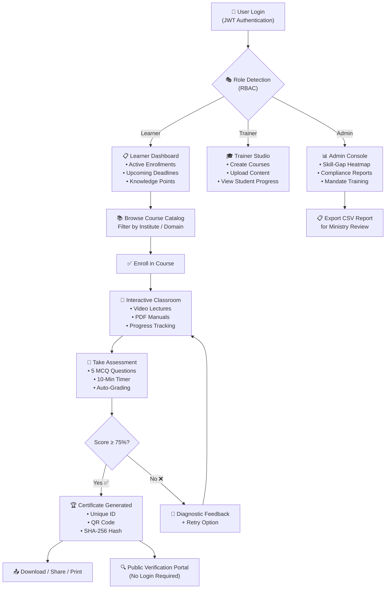
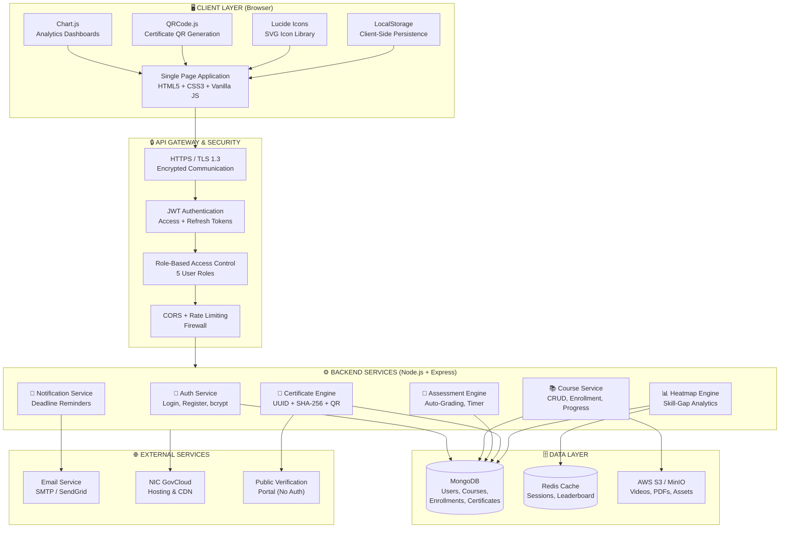

# 🖥️ Capacity Connect — Tech Stack, Process & System Architecture
### PPT Slide Content — Ready to Copy-Paste

---

## 📌 SLIDE: TECH STACK (5 Parts)

---

### 1️⃣ FRONTEND

| Technology | Purpose |
|------------|---------|
| **HTML5** | Semantic page structure & accessibility |
| **CSS3** | Custom properties, Grid, Flexbox, Glassmorphism |
| **Vanilla JavaScript (ES6+)** | Core application logic, DOM manipulation |
| **Chart.js** | Analytics dashboards — bar charts, radar charts, line graphs |
| **Lucide Icons** | Lightweight SVG icon library (CDN) |
| **QRCode.js** | Dynamic QR code generation for certificates |
| **Google Fonts (Inter / Noto Sans)** | Professional typography |

> **Why Vanilla JS?** — Zero framework dependency = faster loading, offline-ready, no build tools required. Ideal for remote locations (radar stations, ocean vessels, Antarctic bases).

---

### 2️⃣ BACKEND (Production Roadmap)

| Technology | Purpose |
|------------|---------|
| **Node.js** | Server-side runtime for API services |
| **Express.js** | RESTful API framework — lightweight & fast |
| **REST API Architecture** | 12+ endpoints for courses, users, certificates, analytics |
| **Multer** | File upload handling (video lectures, PDF manuals) |
| **Node-Cron** | Scheduled tasks — compliance reminders, deadline notifications |
| **PM2** | Production process manager — zero-downtime deployment |

> **Current Prototype:** Client-side only (localStorage). All backend logic is architecturally planned for production deployment on **NIC Cloud / MeitY GovCloud**.

**Key API Endpoints:**
- `POST /api/auth/login` → JWT-based login
- `GET /api/courses` → Course catalog with institute filter
- `POST /api/courses/:id/quiz/submit` → Auto-graded assessment
- `GET /api/certificates/:certId` → Public certificate verification
- `GET /api/admin/analytics/skill-matrix` → Skill-Gap Heatmap data

---

### 3️⃣ DATABASE

| Technology | Purpose |
|------------|---------|
| **MongoDB** | Primary NoSQL database — flexible schema for courses, users, enrollments |
| **Mongoose ODM** | Schema validation & data modeling layer |
| **Redis** | In-memory cache — session management, leaderboard rankings |
| **AWS S3 / MinIO** | Cloud object storage — video lectures, PDF manuals, certificate files |
| **LocalStorage** | Client-side persistence (current prototype) |

**Database Collections:**
- `Users` → Scientist profiles, roles, institute, badges, knowledge points
- `Courses` → Training modules, lessons, quiz question banks
- `Enrollments` → Progress tracking, quiz attempts, completion status
- `Certificates` → Certificate IDs, SHA-256 hashes, verification data

---

### 4️⃣ AUTHENTICATION & DATA PRIVACY

| Technology / Method | Purpose |
|---------------------|---------|
| **JWT (JSON Web Tokens)** | Stateless authentication with access + refresh tokens |
| **bcrypt** | Password hashing (salted, 10 rounds) — never store plain text |
| **Role-Based Access Control (RBAC)** | 5 roles: Super Admin, Institute Admin, Trainer, Learner, Public Verifier |
| **SHA-256 Hashing** | Certificate digital signature — tamper-proof verification |
| **HTTPS / TLS 1.3** | End-to-end encrypted data transmission |
| **CORS Policy** | Restricted cross-origin access to authorized domains only |
| **Data Encryption at Rest** | MongoDB field-level encryption for PII (Aadhaar, email, designation) |

**Privacy Compliance:**
- ✅ **IT Act 2000** (India) — Sections 43A & 72A compliant
- ✅ **Digital Personal Data Protection Act (DPDPA) 2023** — consent-based data collection
- ✅ **NIC Security Guidelines** — government portal security standards
- ✅ **GIGW (Guidelines for Indian Government Websites)** — accessibility & privacy norms

---

### 5️⃣ TESTING

| Testing Type | Tool / Method | What We Test |
|-------------|---------------|-------------|
| **Unit Testing** | Jest | Individual functions — quiz scoring, certificate ID generation, progress calculation |
| **Integration Testing** | Supertest + Jest | API endpoint flows — login → enroll → quiz → certificate |
| **UI/UX Testing** | Cypress | Full user journey — role switching, navigation, form validation |
| **Accessibility Testing** | Lighthouse + axe-core | WCAG 2.1 compliance, screen reader compatibility, color contrast |
| **Performance Testing** | Lighthouse + WebPageTest | Page load time (<2s), asset size, offline capability |
| **Security Testing** | OWASP ZAP | XSS, CSRF, SQL injection, JWT token vulnerability scanning |
| **Cross-Browser Testing** | Manual + BrowserStack | Chrome, Firefox, Edge, Safari compatibility |
| **Load Testing** | Artillery.js | 2000+ concurrent users — server response under stress |

---
---

## 📌 SLIDE: PROCESS ARCHITECTURE (Training Lifecycle Flow)

This shows the **step-by-step user journey** from login to certification:

**PPT Slide Points (Process Flow):**

1. **Login & Role Detection** → User logs in → System detects role (Learner / Trainer / Admin)
2. **Course Discovery** → Learner browses catalog → Filters by institute (IMD, INCOIS, etc.)
3. **Enrollment** → One-click enroll → Mandatory courses auto-assigned by Admin
4. **Interactive Learning** → Video lectures + PDF manuals → Real-time progress tracking
5. **Assessment** → 5 MCQ questions → 10-minute timer → Auto-graded instantly
6. **Certification** → Score ≥ 75% → Digital certificate with QR + SHA-256 hash
7. **Verification** → Anyone can verify certificate publicly → No login needed
8. **Admin Intelligence** → Skill-Gap Heatmap updates automatically → CSV export for ministry

---
---

## 📌 SLIDE: SYSTEM ARCHITECTURE (Full Technical Diagram)

---

**PPT Slide Points (System Architecture):**

1. **Client Layer** → Single Page App (HTML/CSS/JS) + Chart.js for analytics + QRCode.js for certificates
2. **API Gateway** → HTTPS encrypted → JWT token verification → Role-based access control
3. **Backend Microservices** → 6 independent services: Auth, Course, Quiz, Certificate, Heatmap, Notification
4. **Database Layer** → MongoDB (primary data) + Redis (caching & leaderboard) + S3 (file storage)
5. **External Services** → NIC GovCloud hosting + Email notifications + Public verification portal
6. **Security** → End-to-end encryption + bcrypt passwords + SHA-256 certificate hashing + CORS firewall

---
---

## 📌 QUICK REFERENCE: ALL 3 SLIDES SUMMARY

| Slide | Key Takeaway |
|-------|-------------|
| **Tech Stack** | 5 layers — Frontend (HTML/CSS/JS), Backend (Node/Express), Database (MongoDB/Redis), Auth (JWT/SHA-256/RBAC), Testing (Jest/Cypress/Lighthouse) |
| **Process Architecture** | Login → Role Detection → Course Enrollment → Learning → Assessment → Certification → Public Verification |
| **System Architecture** | Client SPA → API Gateway (HTTPS + JWT) → 6 Backend Microservices → MongoDB + Redis + S3 → NIC GovCloud |
